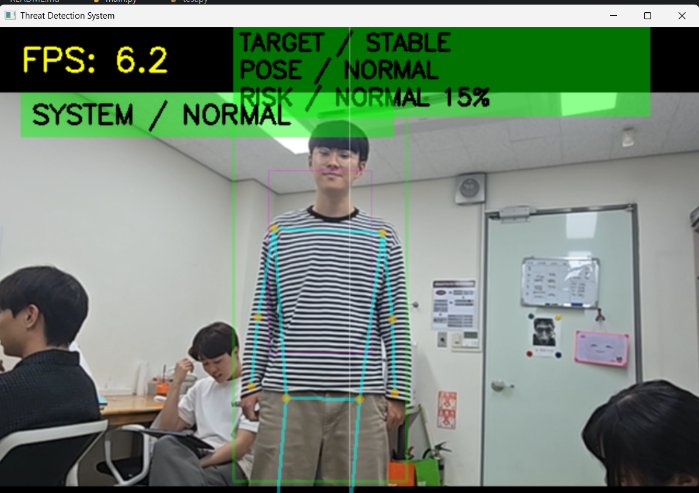
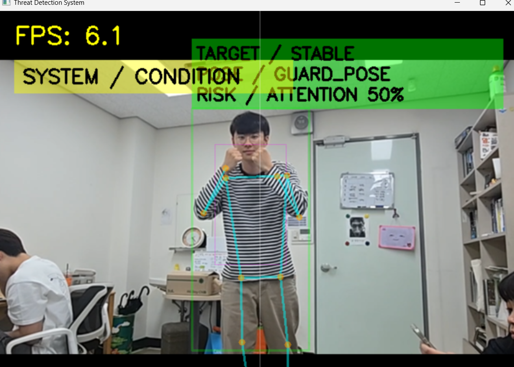
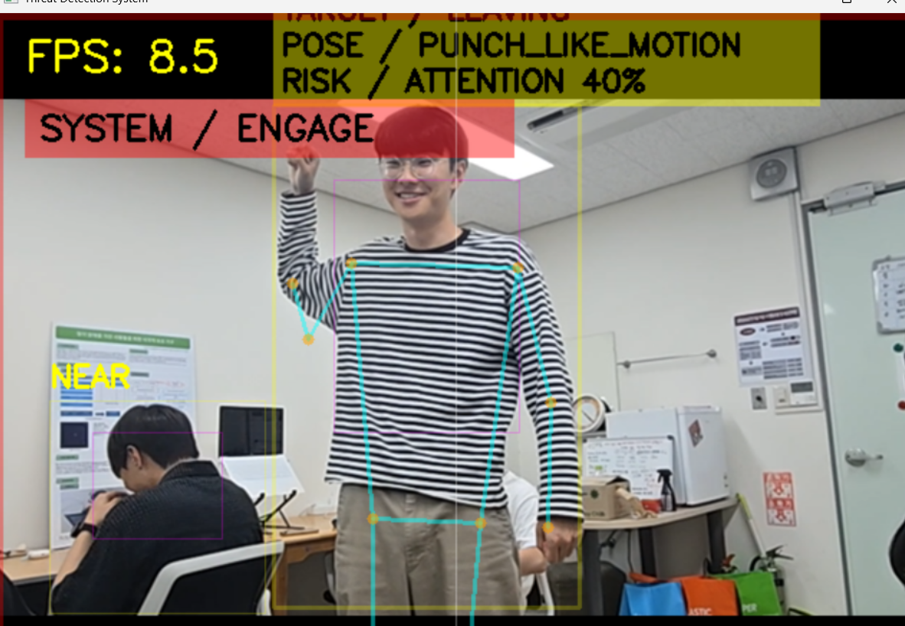

# Threat Detection System

실시간 카메라 영상에서 사람을 검출하고, 대상의 움직임과 자세를 분석하여 위험도를 시각적으로 표시하는 AR 스타일 HUD 시스템입니다.

YOLOv8을 이용한 사람 검출과 MediaPipe Pose를 이용한 자세 추정을 결합하여 대상의 상태를 분석하며, 위험도에 따라 시스템 상태를 표시합니다.

---

## Features
내부 기능 설명입니다.


### Person Detection
- YOLOv8 기반 실시간 사람 검출
- 화면 중앙에 위치한 대상을 자동 선택
- 대상 유지(Target Tracking)

## HUD Information

### Target HUD

```text
TARGET / STABLE
POSE / NORMAL
RISK / NORMAL 15%
```

표시 정보:
- 대상 움직임 상태
- 자세 분석 결과
- 위험도 평가

### System HUD

```text
SYSTEM / NORMAL
SYSTEM / CONDITION
SYSTEM / ENGAGE
```

표시 정보:
- 현재 시스템 대응 상태
- 위협 상황에 따른 상태 전환

---

### Motion Analysis
- APPROACHING
대상이 카메라를 향해 접근 중인 상태

- STABLE
대상이 정지해 있는 상태

- LEAVING
대상이 카메라에서 멀어지는 상태

**
실제 좌표를 통한 움직임이 아니라 박스의 크기 변화를 통해 거리를 파악합니다. 

큰 동작을 통해 박스가 커지면 APPROACHING으로 상태가 변하는 오류가 생길 수 있습니다

### Pose Analysis
- NORMAL
아무것도 하지 않는 차렷자세 상태

- ARMS_RAISED
팔을 들어올리는 상태

- GUARD_POSE
양팔을 몸에 붙이는 가드 상태

- PUNCH_LIKE_MOTION
팔을 휘두르거나 내지르는 상태

### Threat Assessment
- 위험도 점수 계산

- NORMAL :
 대상이 멀어지거나 가만히 있으면 위험도 점수가 내려갑니다.

- ATTENTION :
 대상이 접근하거나 팔을 들어올리면 위험도 점수가 증가합니다.

- THREAT :
 대상이 많이 근접하거나, 주먹을 휘두르는 행동을 취하면 위험도 점수가 급격하게 증가합니다.

### System State
- NORMAL :
 위험도 점수가 낮아 주의할 필요가 없는 상태입니다.

- CONDITION :
 대상이 가드 상태나 어느정도 인접하여 위험도 점수가 어느정도 이상 높아지게 된 상태입니다.
  
- ENGAGE :
 대상이 주먹을 휘두르는 등의 행위로 공격행위가 감지된 상태입니다.

---

## System Pipeline

```text
Camera Input
        ↓
YOLOv8 Person Detection
        ↓
Target Selection
        ↓
Motion Analysis
        ↓
MediaPipe Pose Estimation
        ↓
Threat Assessment
        ↓
HUD Visualization
```

---

## 적용된 기술

- Python
- OpenCV
- YOLOv8
- MediaPipe
- NumPy

---

## Demonstration
(시연은 컴퓨터공학과 이민섭 군이 도와주었습니다.)
### NORMAL

대상이 특별한 행동을 하지 않는 일반 상태



---

### CONDITION

가드 자세 또는 주의가 필요한 상태



---

### ENGAGE

펀치 유사 동작이 감지되어 교전 상태로 전환된 상태



---

## Limitations

- 단일 카메라 기반으로 동작하므로 깊이 정보가 제한적입니다.
- 규칙 기반 위험도 분석을 사용하므로 일부 오탐(False Positive)이 발생할 수 있습니다.
- PUNCH_LIKE_MOTION은 손목 이동량을 기반으로 추정하므로 특정 동작이 공격으로 잘못 분류될 수 있습니다.
- 다수 인원 환경에서는 가장 중심에 위치한 인물을 우선적으로 분석합니다.

---

## Future Work

- 위험 행동 분류 모델 적용
- 다중 대상 위험도 비교
- 모바일 AR 디스플레이 연동
- 이벤트 로그 및 스냅샷 저장 기능
- 실시간 스트리밍 최적화

---
